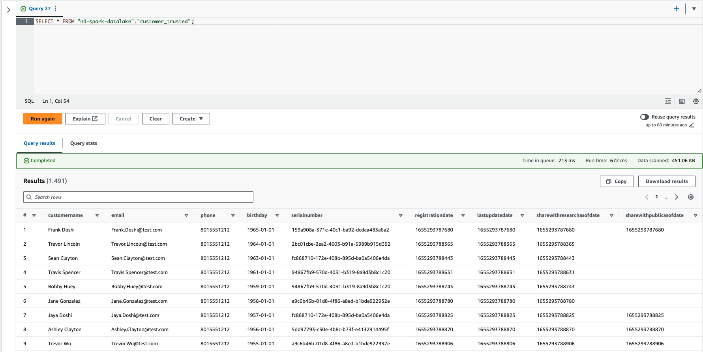

# Project: STEDI Human Balance Analytics

This is a capstone project for the course on [Apache Spark and data lakes with Amazon Web Services](https://www.udacity.com/course/spark-and-data-lakes--cd12441) by Udacity.

## Project Introduction

Spark and AWS Glue allow you to process data from multiple sources, categorize the data, and curate it to be queried in the future for multiple purposes.     
In this project, as a data engineer on the STEDI Step Trainer team, you'll need to extract the data produced by the STEDI Step Trainer sensors and the mobile app, and curate them into a data lakehouse solution on AWS so that Data Scientists can train the learning model.

## Project Details

The STEDI Team has been hard at work developing a hardware STEDI Step Trainer that:
- trains the user to do a STEDI balance exercise;
- and has sensors on the device that collect data to train a machine-learning algorithm to detect steps;
- has a companion mobile app that collects customer data and interacts with the device sensors.

STEDI has heard from millions of early adopters who are willing to purchase the STEDI Step Trainers and use them.

Several customers have already received their Step Trainers, installed the mobile application, and begun using them together to test their balance. The Step Trainer is just a motion sensor that records the distance of the object detected. The app uses a mobile phone accelerometer to detect motion in the X, Y, and Z directions.

The STEDI team wants to use the motion sensor data to train a machine learning model to detect steps accurately in real-time. _Privacy will be a primary consideration in deciding what data can be used._

Some of the early adopters have agreed to share their data for research purposes. **Only these customers’ Step Trainer and accelerometer data should be used in the training data for the machine learning model.**

## Project Instructions

Using AWS Glue, AWS S3, Python, and Spark, create or generate Python scripts to build a lakehouse solution in AWS that satisfies these requirements from the STEDI data scientists.

## Project Summary

### Landing Zone

Using The AWS glue data catalog, I created the following glue tables to query the data using AWS athena.

_**Glue Tables created (SQL DDL scripts):**_ 
* [customer_landing.sql](./scripts/customer_landing.sql)
* [accelerometer_landing.sql](./scripts/accelerometer_landing.sql)

_**Screenshot of select statements from Athena showing the customer landing data and accelerometer landing data:**_ 

* `customer_landing` table:

    

*  `accelerometer_landing` table: 

    

* `step_trainer_landing` table:

    

### Trusted Zone

_**Glue Job Scripts:**_ 
* [customer_landing_to_trusted.py](./scripts/customer_landing_to_trusted.py) - it filters protected PII with Spark in Glue Jobs, i.e. customers who have agreed to share data with researchers;
* [accelerometer_landing_to_trusted_zone.py](./scripts/accelerometer_landing_to_trusted_zone.py) - it filters for Accelerometer readings from customers who have agreed to share data with researchers;
* [trainer_landing_to_trusted.py](./scripts/trainer_landing_to_trusted.py) - it populates `step_trainer_trusted` Glue Table and it filters customers who have accelerometer data and have agreed to share their data for research with Step Trainer readings.
* [trainer_landing_to_trusted_v2.py](./scripts/trainer_landing_to_trusted_v2.py) - it's an alternative version based on S3 data for both step trainer readings and customer curated. This scripts populates `step_trainer/trusted` bucket with the step trainer data of customers who have accelerometer data and who have agreed to share their data for research with Step Trainer readings.

_**Use Athena to query Trusted Glue Tables**_ 

*  `customer_trusted` table: 

    

    

    

### Curated Zone

_**Glue Job Scripts:**_ 
* [customer_trusted_to_curated.py](./scripts/glue_jobs/customer_trusted_to_curated.py) - it filters customers with Accelerometer readings and who agreed to share their data;
* [trainer_trusted_to_curated](./scripts/glue_jobs/trainer_trusted_to_curated.py) - it populates `machine_learning_curated` Glue Table that contains the Step Trainer readings and the associated accelerometer reading data for the same timestamp for customers who have agreed to share their data. Any PII information (i.e. the user field) is dropped.
* [trainer_trusted_to_curated_v2](./scripts/glue_jobs/trainer_trusted_to_curated_v2.py) - it's an alternative version based on S3 data for both step trainer trusted readings and accelerometer trusted data. This script populates `machine_learning_curated` Glue Table that contains the Step Trainer readings and the associated accelerometer reading data for the same timestamp for customers who have agreed to share their data. Any PII information (i.e. the user field) is dropped.

### Glue Tables on Athena

_**Screenshot of all Glue Tables**_ 

